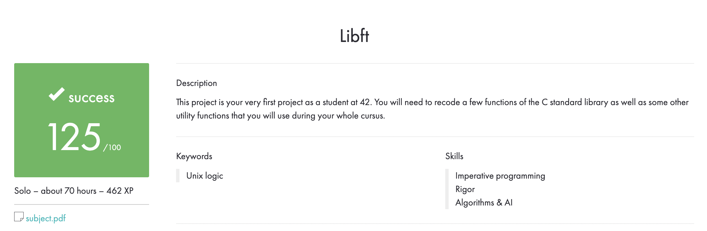

# 42-Libft
This project is about coding a C library.
It contains a lot of general purpose functions

# Makefile
|Command | Action|
|--------|-------|
| `make` |compiles .c files and builds libft.a|
|`make clean`|       |
|'make fclean'|       |
|'make re'|       |

